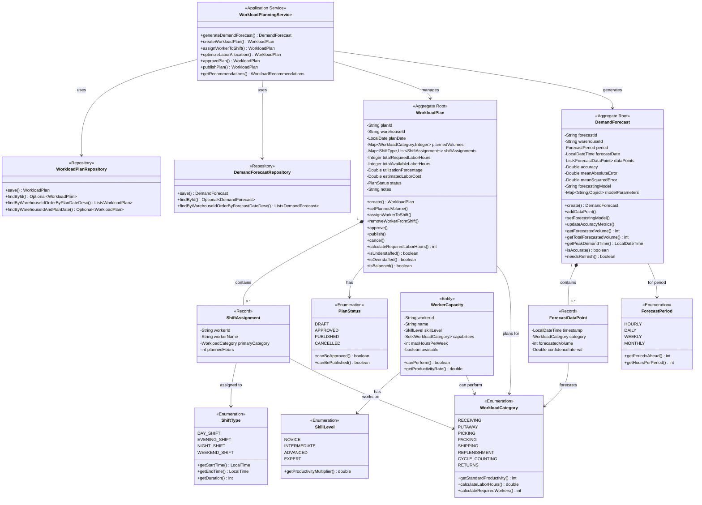

# Workload Planning Service - Domain Model

## Overview

The Workload Planning Service domain model is designed around workforce optimization, combining demand forecasting with labor capacity planning to create optimal staffing schedules.

## Domain Model Diagram



## Aggregate Roots

### 1. WorkloadPlan

**Purpose**: Represents a staffing plan for a specific date combining demand forecasts with worker assignments.

**Key Responsibilities**:
- Store planned volumes by workload category
- Manage worker-to-shift assignments
- Calculate labor hour requirements
- Track utilization and costs
- Enforce approval workflow

**Invariants**:
- Plan date must be in future or today
- Utilization percentage accurately reflects hours ratio
- Only DRAFT plans can be approved
- Only APPROVED plans can be published
- Worker assignments match shift types

**Business Rules**:
```java
// Utilization calculation
utilization = (totalRequiredHours / totalAvailableHours) * 100

// Staffing status
understaffed: utilization < 85%
balanced: 85% <= utilization <= 110%
overstaffed: utilization > 110%

// Workflow
DRAFT → approve() → APPROVED → publish() → PUBLISHED
Any → cancel(reason) → CANCELLED
```

### 2. DemandForecast

**Purpose**: Time series forecast predicting future workload volumes.

**Key Responsibilities**:
- Store forecasted volumes by time and category
- Track forecasting model and parameters
- Monitor accuracy metrics
- Identify peak demand periods
- Trigger refresh when stale

**Invariants**:
- Data points ordered by timestamp
- Accuracy metrics between 0-100%
- Confidence intervals are positive
- Forecast period matches data point timestamps

**Business Rules**:
```java
// Refresh criteria
HOURLY: refresh after 1 hour
DAILY: refresh after 24 hours
WEEKLY: refresh after 168 hours
MONTHLY: refresh after 720 hours

// Accuracy threshold
accurate: accuracy >= 85%
needsRefinement: accuracy < 85%

// Confidence intervals
standard: 95% confidence (1.96 * std deviation)
```

## Entities

### ShiftAssignment (Record)

Worker assignment to a specific shift:
```java
record ShiftAssignment(
    String workerId,
    String workerName,
    WorkloadCategory primaryCategory,
    int plannedHours
)
```

### ForecastDataPoint (Record)

Single forecast prediction:
```java
record ForecastDataPoint(
    LocalDateTime timestamp,
    WorkloadCategory category,
    int forecastedVolume,
    Double confidenceInterval
)
```

### WorkerCapacity

Worker skills and availability:
```java
class WorkerCapacity {
    String workerId;
    String name;
    SkillLevel skillLevel;
    Set<WorkloadCategory> capabilities;
    int maxHoursPerWeek;
    boolean available;

    boolean canPerform(WorkloadCategory category) {
        return available && capabilities.contains(category);
    }

    double getProductivityRate(WorkloadCategory category) {
        double base = category.getStandardProductivity();
        return base * skillLevel.getProductivityMultiplier();
    }
}
```

## Value Objects

### WorkloadCategory

```java
public enum WorkloadCategory {
    RECEIVING(25),        // 25 units/hour
    PUTAWAY(40),          // 40 units/hour
    PICKING(50),          // 50 units/hour
    PACKING(30),          // 30 units/hour
    SHIPPING(35),         // 35 units/hour
    REPLENISHMENT(45),    // 45 units/hour
    CYCLE_COUNTING(100),  // 100 units/hour
    RETURNS(20);          // 20 units/hour

    private final int standardProductivity;

    public double calculateLaborHours(int volume) {
        return (double) volume / standardProductivity;
    }

    public int calculateRequiredWorkers(int volume, int shiftHours) {
        double hours = calculateLaborHours(volume);
        return (int) Math.ceil(hours / shiftHours);
    }
}
```

### ShiftType

```java
public enum ShiftType {
    DAY_SHIFT(LocalTime.of(8, 0), LocalTime.of(16, 0)),
    EVENING_SHIFT(LocalTime.of(16, 0), LocalTime.of(0, 0)),
    NIGHT_SHIFT(LocalTime.of(0, 0), LocalTime.of(8, 0)),
    WEEKEND_SHIFT(LocalTime.of(8, 0), LocalTime.of(20, 0));

    private final LocalTime startTime;
    private final LocalTime endTime;

    public int getDuration() {
        // Calculate hours between start and end
    }
}
```

### SkillLevel

```java
public enum SkillLevel {
    NOVICE(0.7),        // 70% of standard productivity
    INTERMEDIATE(1.0),   // 100% of standard
    ADVANCED(1.2),       // 120% of standard
    EXPERT(1.5);         // 150% of standard

    private final double productivityMultiplier;

    public double getProductivityMultiplier() {
        return productivityMultiplier;
    }
}
```

### ForecastPeriod

```java
public enum ForecastPeriod {
    HOURLY(24, 1),     // 24 periods, 1 hour each
    DAILY(7, 24),      // 7 periods, 24 hours each
    WEEKLY(4, 168),    // 4 periods, 168 hours each
    MONTHLY(12, 720);  // 12 periods, 720 hours each

    private final int periodsAhead;
    private final int hoursPerPeriod;
}
```

## Domain Events

### ForecastGeneratedEvent
```json
{
  "eventType": "FORECAST_GENERATED",
  "forecastId": "FC-12345",
  "warehouseId": "WH-001",
  "period": "DAILY",
  "model": "MOVING_AVERAGE",
  "accuracy": 92.5,
  "timestamp": "2025-10-19T10:00:00Z"
}
```

### PlanCreatedEvent
```json
{
  "eventType": "PLAN_CREATED",
  "planId": "WP-12345",
  "warehouseId": "WH-001",
  "planDate": "2025-10-20",
  "totalRequiredHours": 120,
  "timestamp": "2025-10-19T11:00:00Z"
}
```

### WorkerAssignedEvent
```json
{
  "eventType": "WORKER_ASSIGNED",
  "planId": "WP-12345",
  "workerId": "W-001",
  "workerName": "John Doe",
  "shift": "DAY_SHIFT",
  "category": "PICKING",
  "plannedHours": 8,
  "timestamp": "2025-10-19T11:30:00Z"
}
```

### PlanApprovedEvent
```json
{
  "eventType": "PLAN_APPROVED",
  "planId": "WP-12345",
  "warehouseId": "WH-001",
  "approvedBy": "SUPERVISOR-001",
  "totalWorkers": 15,
  "utilization": 95.2,
  "timestamp": "2025-10-19T14:00:00Z"
}
```

## Bounded Context

Workload Planning context focuses on:
- **IN SCOPE**: Demand forecasting, labor planning, worker assignment, utilization optimization
- **OUT OF SCOPE**: Time tracking (HR System), task execution (Task Execution Service), actual worker location (Physical Tracking)

## Design Patterns

### 1. Aggregate Pattern
- WorkloadPlan and DemandForecast are aggregate roots
- Shift assignments and forecast data points are part of aggregates

### 2. Value Object Pattern
- Enums as immutable value objects
- Records for lightweight data structures

### 3. Strategy Pattern
- Multiple forecasting algorithms (Moving Average, Exponential Smoothing)
- Pluggable optimization strategies

### 4. Domain Events
- Events published on forecast generation and plan approval
- Enables integration with HR and supervisor systems
