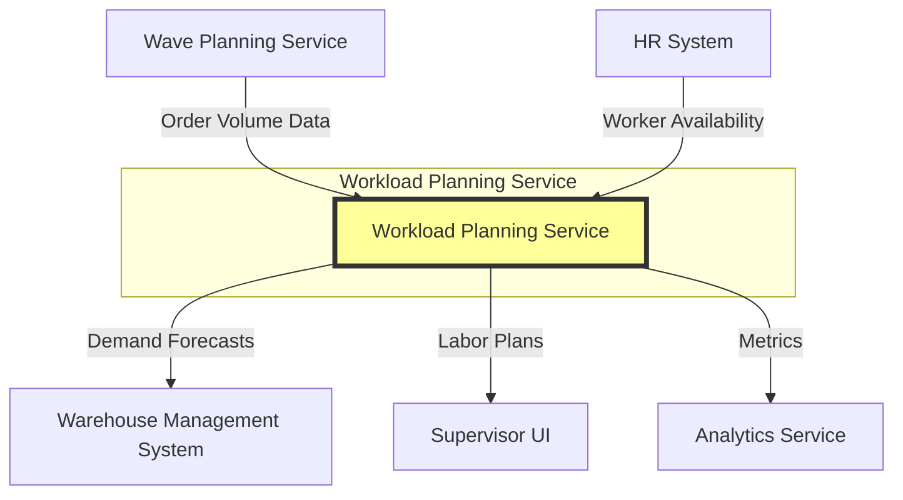

# Workload Planning Service

## Overview

The Workload Planning Service is a strategic microservice in the PakLog WMS that provides intelligent workforce planning, demand forecasting, and labor optimization. It ensures that warehouse operations have the right number of workers with the right skills at the right time to meet operational demands efficiently.

## Purpose

This service solves the critical problem of labor optimization by:
- Forecasting workload demand using historical data and trends
- Planning optimal workforce allocation across shifts
- Balancing labor supply with operational demand
- Optimizing labor costs while meeting service levels
- Providing actionable recommendations for staffing decisions

## Architecture

### Technology Stack

- **Framework**: Spring Boot 3.x
- **Database**: MongoDB (Document-oriented for flexible planning data)
- **Event Bus**: Kafka for publishing workload events
- **API Style**: RESTful HTTP + Event-Driven

### Architectural Style

The service follows **Domain-Driven Design (DDD)** principles with:
- **Aggregate Roots**: WorkloadPlan, DemandForecast
- **Entities**: WorkerCapacity, ShiftAssignment
- **Value Objects**: ShiftType, WorkloadCategory, SkillLevel, ForecastPeriod
- **Application Services**: WorkloadPlanningService
- **Repositories**: WorkloadPlanRepository, DemandForecastRepository

### System Context



## Core Concepts

### Demand Forecast

A **Demand Forecast** predicts future workload volumes using time series analysis:
- Historical data analysis
- Trend identification
- Seasonal pattern recognition
- Multiple forecasting models (Moving Average, Exponential Smoothing, ARIMA)
- Accuracy tracking and model refinement

**Forecast Periods**:
- `HOURLY` - Next 24 hours
- `DAILY` - Next 7 days
- `WEEKLY` - Next 4 weeks
- `MONTHLY` - Next 12 months

### Workload Plan

A **Workload Plan** translates forecasts into actionable staffing plans:
- Planned volumes by workload category
- Worker assignments to shifts
- Labor hour requirements
- Utilization calculations
- Cost estimates

**Plan Status**:
- `DRAFT` - Being created/edited
- `APPROVED` - Approved by supervisor
- `PUBLISHED` - Active and visible to workers
- `CANCELLED` - Cancelled with reason

### Workload Categories

Different warehouse operations have different labor requirements:

- **RECEIVING** - Unloading, inspection, putaway (25 units/hour)
- **PUTAWAY** - Moving to storage (40 units/hour)
- **PICKING** - Order picking (50 units/hour)
- **PACKING** - Order packing (30 units/hour)
- **SHIPPING** - Loading, dispatch (35 units/hour)
- **REPLENISHMENT** - Stock replenishment (45 units/hour)
- **CYCLE_COUNTING** - Inventory counting (100 units/hour)
- **RETURNS** - Returns processing (20 units/hour)

Each category has:
- Standard productivity rate (units per hour)
- Skill level requirements
- Equipment needs

### Shift Types

Workforce organized across standard shifts:

- **DAY_SHIFT** - 8:00 AM - 4:00 PM
- **EVENING_SHIFT** - 4:00 PM - 12:00 AM
- **NIGHT_SHIFT** - 12:00 AM - 8:00 AM
- **WEEKEND_SHIFT** - Saturday/Sunday coverage

## Key Features

### 1. Demand Forecasting
- Time series forecasting with multiple algorithms
- Historical data analysis
- Seasonal pattern detection
- Accuracy tracking and validation
- Confidence interval calculation

### 2. Labor Planning
- Automatic labor requirement calculation
- Skill-based worker assignment
- Multi-shift optimization
- Balanced workload distribution

### 3. Optimization
- Labor cost minimization
- Utilization optimization (target 85-100%)
- Skill matching
- Worker preference consideration

### 4. Recommendations
- Understaffing/overstaffing alerts
- Hiring recommendations
- Shift adjustment suggestions
- Productivity improvement insights

### 5. Plan Lifecycle
- Draft → Approved → Published workflow
- Plan versioning
- Cancellation with reason tracking
- Historical plan analysis

## API Endpoints

### Demand Forecasting

```http
POST   /api/workload/forecasts
GET    /api/workload/forecasts/{forecastId}
GET    /api/workload/forecasts/warehouse/{warehouseId}
```

### Workload Planning

```http
POST   /api/workload/plans
GET    /api/workload/plans/{planId}
GET    /api/workload/plans/warehouse/{warehouseId}
POST   /api/workload/plans/{planId}/workers
DELETE /api/workload/plans/{planId}/workers/{workerId}
POST   /api/workload/plans/{planId}/optimize
```

### Plan Approval

```http
POST   /api/workload/plans/{planId}/approve
POST   /api/workload/plans/{planId}/publish
POST   /api/workload/plans/{planId}/cancel
```

### Recommendations

```http
GET    /api/workload/recommendations?warehouseId={id}&date={date}
```

## Integration Points

### Consumes Events From
- **Wave Planning Service**: Wave volumes and timing
- **Task Execution Service**: Task completion metrics
- **HR System**: Worker availability and skills

### Publishes Events To
- **HR System**: Staffing requirements
- **Supervisor UI**: Plan updates and alerts
- **Analytics**: Workforce metrics

## Forecasting Models

### Moving Average
Simple average of last N periods:
```
forecast = (data[n-7] + data[n-6] + ... + data[n-1]) / 7
```

### Exponential Smoothing
Weighted average with decay:
```
forecast = α * actual + (1 - α) * previous_forecast
α = 0.3 (smoothing factor)
```

### Seasonal Decomposition
Separates trend, seasonal, and irregular components:
```
data = trend + seasonal + irregular
```

## Business Rules

### 1. Forecasting Rules
- Minimum 7 days historical data required
- Forecast refresh based on period (hourly/daily/weekly/monthly)
- Accuracy threshold: 85% minimum
- Confidence interval: 95% standard

### 2. Planning Rules
- Utilization target: 85-100%
- Understaffed: <85% utilization
- Overstaffed: >110% utilization
- Optimal: 85-110% utilization

### 3. Worker Assignment
- Match skills to workload category
- Distribute evenly across shifts
- Respect worker availability
- Consider skill levels (NOVICE, INTERMEDIATE, ADVANCED, EXPERT)

### 4. Approval Workflow
- Only DRAFT plans can be approved
- Only APPROVED plans can be published
- PUBLISHED plans visible to workers
- CANCELLED plans cannot be reactivated

## Calculation Examples

### Labor Hours Calculation
```java
// For PICKING category with 500 units planned
pickingRate = 50 units/hour
requiredHours = 500 units / 50 units/hour = 10 hours
workers = ceil(10 hours / 8 hour shift) = 2 workers
```

### Utilization Calculation
```java
totalRequired = 40 hours
totalAvailable = 48 hours (6 workers * 8 hours)
utilization = (40 / 48) * 100 = 83.3%
status = UNDERSTAFFED (< 85%)
```

### Cost Estimation
```java
totalHours = 48 hours
avgWage = $25/hour
estimatedCost = 48 * $25 = $1,200
```

## Monitoring and Metrics

### Key Metrics
- Forecast accuracy percentage
- Plan utilization percentage
- Labor cost per unit
- Worker productivity by category
- Plan approval time

### Health Checks
- MongoDB connectivity
- Kafka producer health
- Forecasting model performance
- Data completeness

## Performance Considerations

### Scalability
- Horizontal scaling for forecasting calculations
- Asynchronous forecast generation
- Caching of frequently accessed plans
- Batch optimization for multiple warehouses

### Optimization
- Indexes on warehouseId, planDate, forecastDate
- Materialized forecast aggregations
- Lazy loading of historical data
- Parallel worker assignment algorithm

## Deployment

### Prerequisites
- MongoDB 5.0+
- Kafka 3.0+
- Java 21+

### Docker Deployment

```bash
docker build -t paklog/workload-planning-service:latest .
docker run -p 8080:8080 \
  -e SPRING_DATA_MONGODB_URI=mongodb://mongo:27017/workload-planning \
  -e SPRING_KAFKA_BOOTSTRAP_SERVERS=kafka:9092 \
  paklog/workload-planning-service:latest
```

## Future Enhancements

1. **Advanced Forecasting**
   - ARIMA/Prophet models
   - External factor integration (weather, events)
   - Real-time forecast adjustment

2. **AI-Driven Optimization**
   - Reinforcement learning for assignment
   - Predictive worker performance
   - Automated skill development recommendations

3. **Integration Enhancements**
   - Direct shift scheduling
   - Time and attendance integration
   - Mobile worker app

4. **Analytics**
   - Productivity dashboards
   - Cost analysis and trends
   - What-if scenario planning

## Related Services

- **Wave Planning Service** - Provides demand signals
- **Task Execution Service** - Provides productivity data
- **HR System** - Worker management
- **Analytics Service** - Reporting and insights
