# Workload Planning Service - Sequence Diagrams

## Overview

This document contains sequence diagrams for key operational flows in the Workload Planning Service.

## 1. Generate Demand Forecast

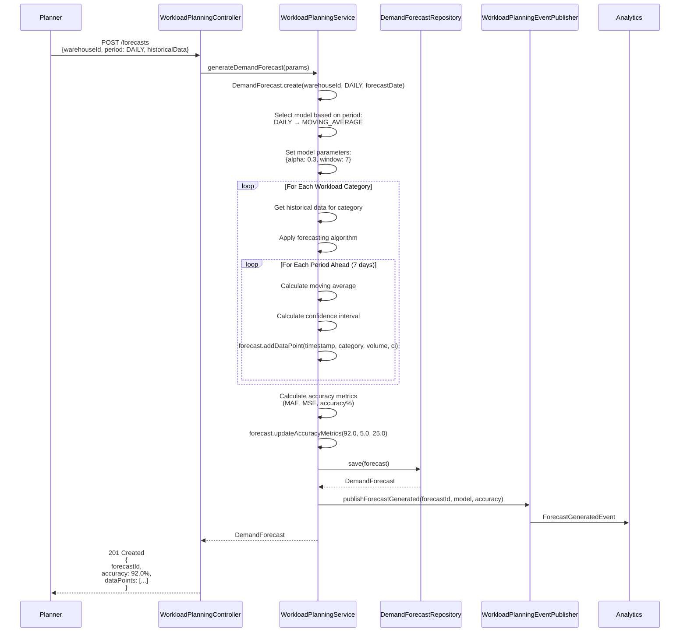

## 2. Create Workload Plan from Forecast

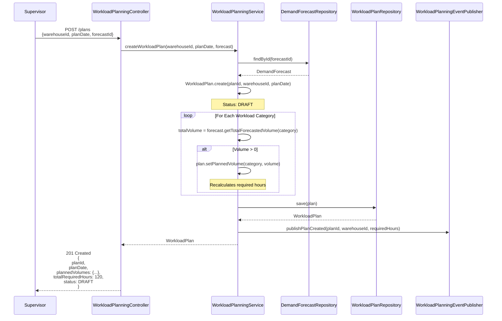

## 3. Assign Workers to Shifts

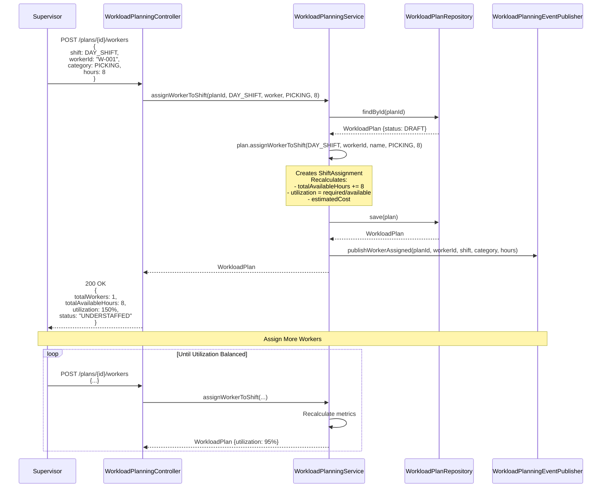

## 4. Optimize Labor Allocation

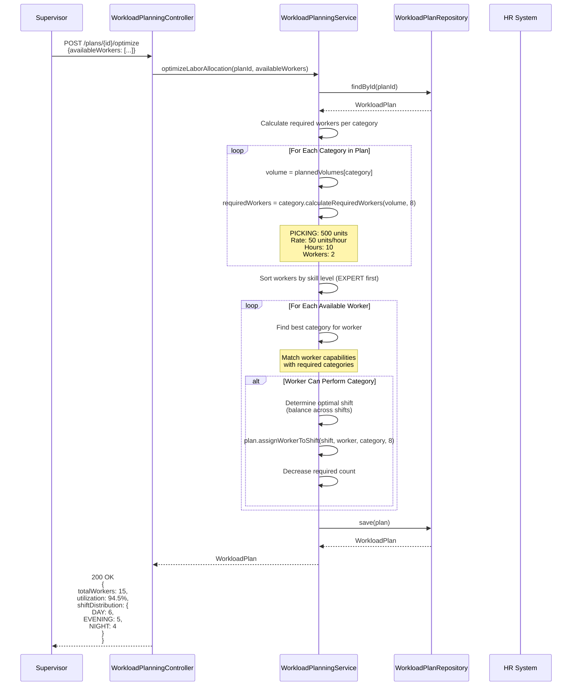

## 5. Approve and Publish Plan

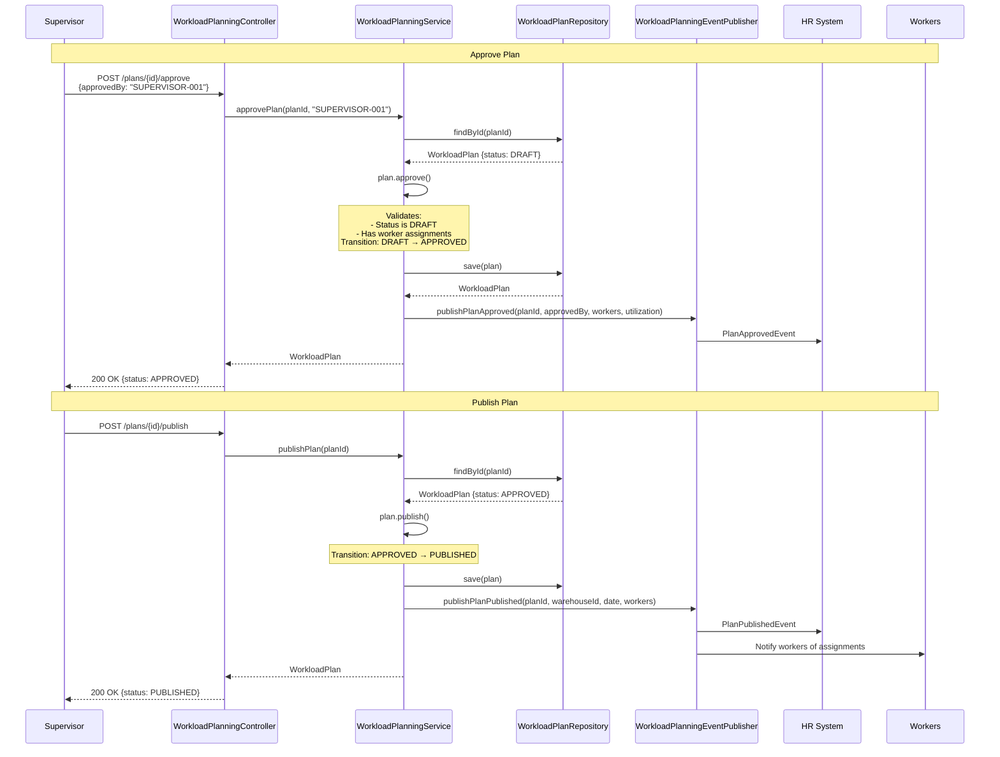

## 6. Get Workload Recommendations

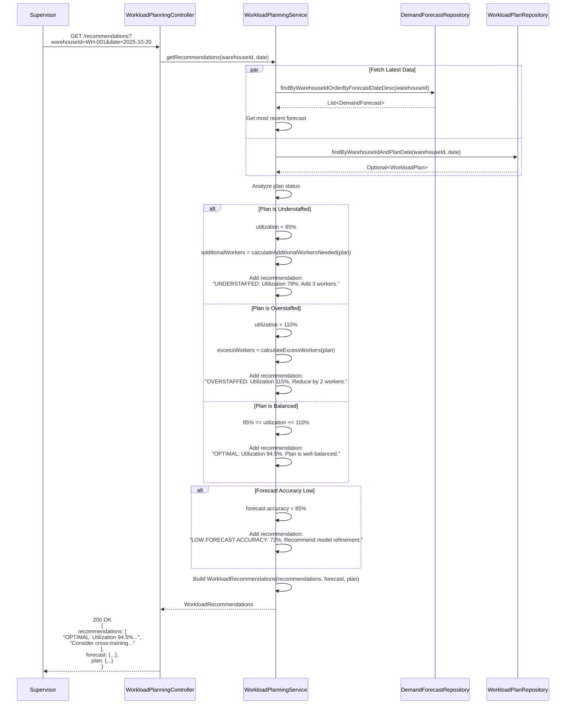

## 7. Cancel Workload Plan

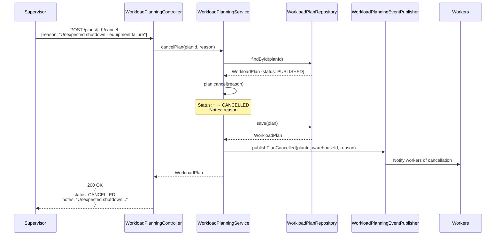

## 8. Forecast Refresh Check

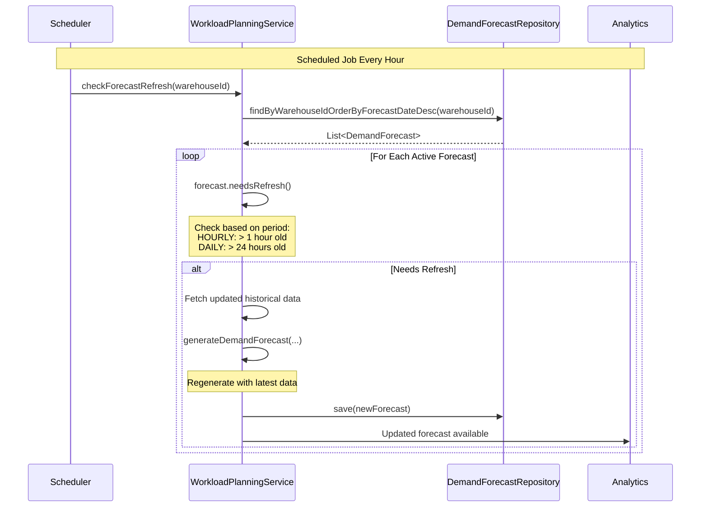

## 9. Historical Performance Analysis

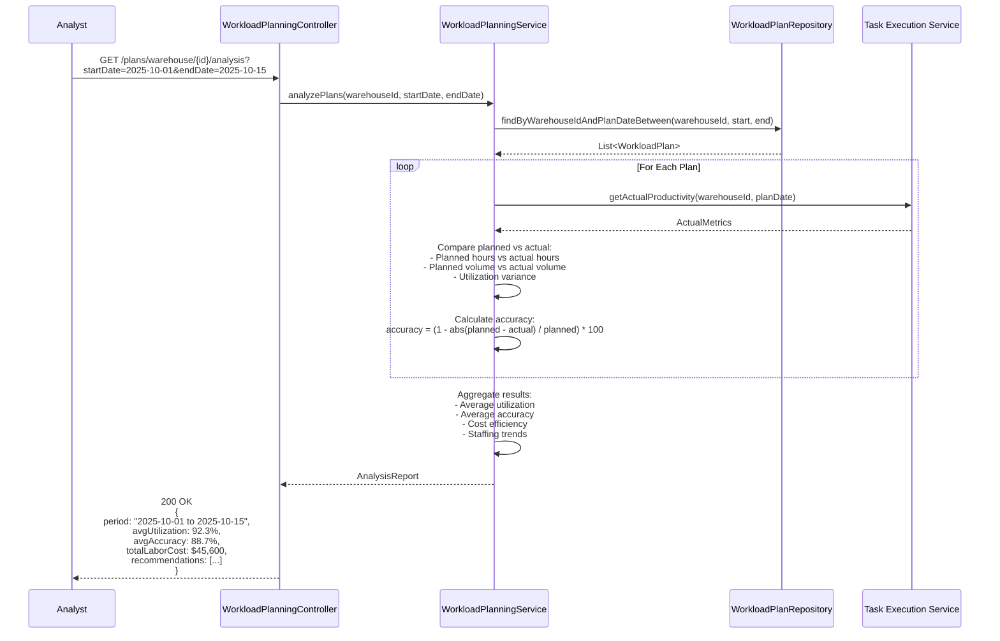

## 10. Worker Productivity Tracking

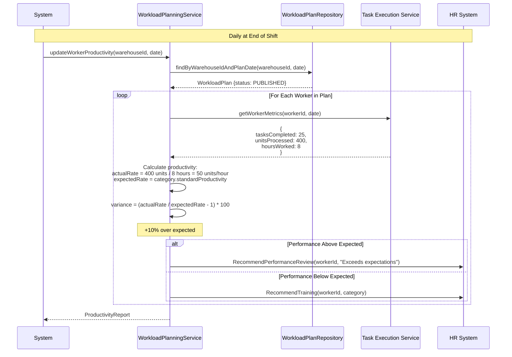

## Error Scenarios

### Approve Non-Draft Plan
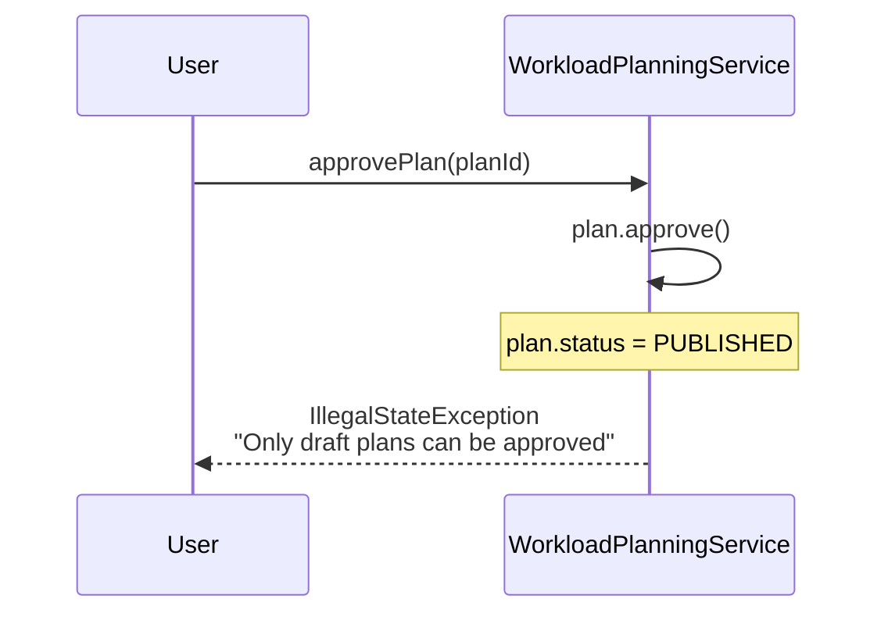

### Insufficient Historical Data
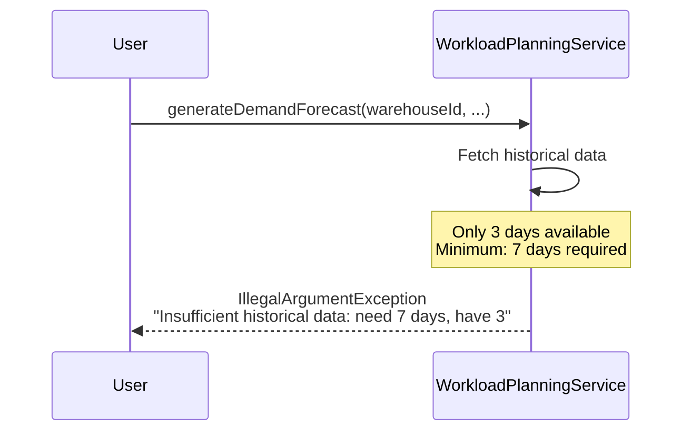

### Assign Worker to Wrong Category
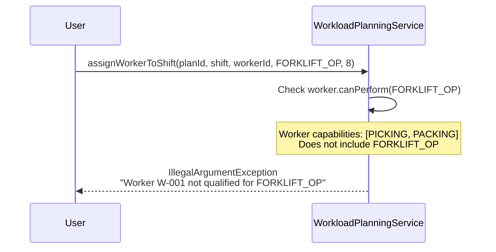
