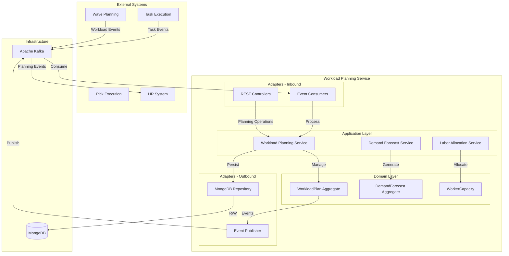

# Workload Planning Service - Architecture

Warehouse workforce planning and resource allocation with demand forecasting and labor optimization.

## High-Level System Architecture



## Application Services

### Workload Planning Service
- `createWorkloadPlan(PlanRequest)` - Create new plan
- `assignWorkerToShift(String planId, String workerId, ShiftType shift)` - Assign worker
- `removeWorkerFromShift(String planId, String workerId)` - Remove worker
- `optimizeLaborAllocation(String planId)` - Optimize assignments
- `approvePlan(String planId)` - Approve plan
- `publishPlan(String planId)` - Publish to workers
- `cancelPlan(String planId)` - Cancel plan

### Demand Forecast Service
- `generateForecast(String warehouseId, ForecastPeriod period)` - Create forecast
- `updateAccuracyMetrics(String forecastId, ActualData)` - Update accuracy
- `getForecastedVolume(String warehouseId, LocalDate date)` - Get prediction
- `analyzeTrends(String warehouseId)` - Trend analysis
- `refreshForecast(String forecastId)` - Recalculate forecast

### Labor Allocation Service
- `calculateRequiredLaborHours(WorkloadPlan)` - Calculate needs
- `findAvailableWorkers(LocalDate date, Set<WorkloadCategory>)` - Find workers
- `optimizeAllocation(WorkloadPlan, List<WorkerCapacity>)` - Optimize
- `balanceShiftLoad(WorkloadPlan)` - Balance shifts
- `getRecommendations(WorkloadPlan)` - Get suggestions

## Demand Forecasting Algorithms

### Time Series Forecasting

```java
public DemandForecast generateTimeSeries(
    String warehouseId,
    ForecastPeriod period
) {
    // Retrieve historical data (last 90 days)
    List<WorkloadData> historicalData = getHistoricalData(warehouseId, 90);

    // Calculate seasonal factors
    Map<DayOfWeek, Double> seasonalFactors = calculateSeasonalFactors(historicalData);

    // Calculate trend
    double trend = calculateTrend(historicalData);

    // Generate forecast data points
    List<ForecastDataPoint> dataPoints = new ArrayList<>();
    LocalDateTime forecastStart = LocalDateTime.now();

    for (int i = 0; i < period.getPeriodsAhead(); i++) {
        LocalDateTime timestamp = forecastStart.plus(i, period.getChronoUnit());

        for (WorkloadCategory category : WorkloadCategory.values()) {
            double baseVolume = getBaseVolume(historicalData, category);
            double seasonalAdjustment = seasonalFactors.get(timestamp.getDayOfWeek());
            double trendAdjustment = trend * i;

            int forecastedVolume = (int) (baseVolume * seasonalAdjustment + trendAdjustment);

            dataPoints.add(new ForecastDataPoint(
                timestamp,
                category,
                forecastedVolume,
                calculateConfidenceInterval(historicalData, category)
            ));
        }
    }

    return new DemandForecast(
        UUID.randomUUID().toString(),
        warehouseId,
        period,
        LocalDateTime.now(),
        dataPoints,
        "TIME_SERIES"
    );
}
```

### Moving Average Forecasting

```java
public int forecastMovingAverage(
    List<WorkloadData> historicalData,
    WorkloadCategory category,
    int periods
) {
    // Use weighted moving average
    double[] weights = {0.5, 0.3, 0.2};  // Recent data weighted higher

    int sum = 0;
    double weightSum = 0;

    for (int i = 0; i < Math.min(periods, historicalData.size()); i++) {
        WorkloadData data = historicalData.get(historicalData.size() - 1 - i);
        double weight = weights[Math.min(i, weights.length - 1)];

        sum += data.getVolume(category) * weight;
        weightSum += weight;
    }

    return (int) (sum / weightSum);
}
```

## Labor Hour Calculation

### Calculate Required Labor Hours

```java
public int calculateRequiredLaborHours(
    Map<WorkloadCategory, Integer> plannedVolumes,
    Map<SkillLevel, Integer> workersBySkill
) {
    int totalRequiredHours = 0;

    for (Map.Entry<WorkloadCategory, Integer> entry : plannedVolumes.entrySet()) {
        WorkloadCategory category = entry.getKey();
        int volume = entry.getValue();

        // Get standard productivity for category
        int standardProductivity = category.getStandardProductivity();

        // Calculate average skill multiplier
        double avgSkillMultiplier = calculateAverageSkillMultiplier(workersBySkill);

        // Calculate required hours
        double requiredHours = (double) volume / standardProductivity / avgSkillMultiplier;

        totalRequiredHours += Math.ceil(requiredHours);
    }

    return totalRequiredHours;
}

private double calculateAverageSkillMultiplier(Map<SkillLevel, Integer> workersBySkill) {
    double totalMultiplier = 0;
    int totalWorkers = 0;

    for (Map.Entry<SkillLevel, Integer> entry : workersBySkill.entrySet()) {
        totalMultiplier += entry.getKey().getProductivityMultiplier() * entry.getValue();
        totalWorkers += entry.getValue();
    }

    return totalWorkers > 0 ? totalMultiplier / totalWorkers : 1.0;
}
```

## Labor Allocation Optimization

### Optimize Worker Assignments

```java
public WorkloadPlan optimizeAllocation(
    WorkloadPlan plan,
    List<WorkerCapacity> availableWorkers
) {
    Map<WorkloadCategory, Integer> requiredHours = calculateRequiredHoursByCategory(plan);
    Map<ShiftType, List<WorkerCapacity>> workersByShift = new HashMap<>();

    // Initialize shift assignments
    for (ShiftType shift : ShiftType.values()) {
        workersByShift.put(shift, new ArrayList<>());
    }

    // Sort workers by skill level (highest first)
    availableWorkers.sort(
        Comparator.comparing(WorkerCapacity::getSkillLevel).reversed()
    );

    // Allocate workers to shifts
    for (WorkerCapacity worker : availableWorkers) {
        ShiftType optimalShift = findOptimalShift(
            worker,
            workersByShift,
            requiredHours
        );

        if (optimalShift != null) {
            assignWorkerToShift(plan, worker, optimalShift);
            workersByShift.get(optimalShift).add(worker);
        }
    }

    // Balance workload across shifts
    balanceShiftLoad(plan, workersByShift);

    return plan;
}

private ShiftType findOptimalShift(
    WorkerCapacity worker,
    Map<ShiftType, List<WorkerCapacity>> workersByShift,
    Map<WorkloadCategory, Integer> requiredHours
) {
    ShiftType bestShift = null;
    double bestScore = Double.NEGATIVE_INFINITY;

    for (ShiftType shift : ShiftType.values()) {
        double score = calculateShiftScore(
            shift,
            worker,
            workersByShift.get(shift),
            requiredHours
        );

        if (score > bestScore) {
            bestScore = score;
            bestShift = shift;
        }
    }

    return bestShift;
}
```

## Database Design

### WorkloadPlan Collection

```json
{
  "_id": "plan-12345",
  "planId": "plan-12345",
  "warehouseId": "warehouse-1",
  "planDate": "2025-10-20",
  "plannedVolumes": {
    "RECEIVING": 500,
    "PUTAWAY": 450,
    "PICKING": 1000,
    "PACKING": 800,
    "SHIPPING": 750
  },
  "shiftAssignments": {
    "DAY_SHIFT": [
      {
        "workerId": "worker-123",
        "workerName": "John Doe",
        "primaryCategory": "PICKING",
        "plannedHours": 8
      }
    ],
    "EVENING_SHIFT": [],
    "NIGHT_SHIFT": []
  },
  "totalRequiredLaborHours": 120,
  "totalAvailableLaborHours": 128,
  "utilizationPercentage": 93.75,
  "estimatedLaborCost": 1920.00,
  "status": "APPROVED",
  "createdAt": "2025-10-19T10:00:00Z",
  "approvedAt": "2025-10-19T14:00:00Z"
}
```

### DemandForecast Collection

```json
{
  "_id": "forecast-12345",
  "forecastId": "forecast-12345",
  "warehouseId": "warehouse-1",
  "period": "DAILY",
  "forecastDate": "2025-10-19T10:00:00Z",
  "dataPoints": [
    {
      "timestamp": "2025-10-20T00:00:00Z",
      "category": "PICKING",
      "forecastedVolume": 1000,
      "confidenceInterval": 0.85
    }
  ],
  "accuracy": 0.92,
  "meanAbsoluteError": 45.3,
  "meanSquaredError": 2156.7,
  "forecastingModel": "TIME_SERIES",
  "modelParameters": {
    "seasonalFactors": {
      "MONDAY": 1.1,
      "TUESDAY": 1.0
    },
    "trend": 2.5
  }
}
```

### MongoDB Indexes

```javascript
// WorkloadPlan indexes
db.workloadPlans.createIndex({ "planId": 1 }, { unique: true })
db.workloadPlans.createIndex({ "warehouseId": 1, "planDate": -1 })
db.workloadPlans.createIndex({ "warehouseId": 1, "status": 1 })
db.workloadPlans.createIndex({ "planDate": 1, "status": 1 })

// DemandForecast indexes
db.demandForecasts.createIndex({ "forecastId": 1 }, { unique: true })
db.demandForecasts.createIndex({ "warehouseId": 1, "forecastDate": -1 })
db.demandForecasts.createIndex({ "warehouseId": 1, "period": 1 })
```

## Configuration

```yaml
# Forecast Configuration
forecast:
  history-days-required: 30
  refresh-interval: 6h
  model: TIME_SERIES  # TIME_SERIES, MOVING_AVERAGE, REGRESSION, ML
  confidence-level: 0.85

# Planning Configuration
plan:
  utilization:
    min-threshold: 90   # Understaffed alert
    max-threshold: 110  # Overstaffed alert
  labor-cost:
    hourly-rate: 15.00
    overtime-multiplier: 1.5
  advance-days: 7  # Plan 7 days ahead

# Worker Configuration
worker:
  max-hours-per-week: 40
  max-hours-per-day: 10

# MongoDB
spring:
  data:
    mongodb:
      uri: mongodb://localhost:27017/workload-planning
      auto-index-creation: true
```

## Forecast Accuracy Tracking

### Update Accuracy Metrics

```java
public void updateAccuracyMetrics(String forecastId, ActualWorkloadData actual) {
    DemandForecast forecast = forecastRepository.findById(forecastId);

    double totalError = 0;
    double totalSquaredError = 0;
    int dataPointCount = 0;

    for (ForecastDataPoint dataPoint : forecast.getDataPoints()) {
        int actualVolume = actual.getVolume(
            dataPoint.getTimestamp(),
            dataPoint.getCategory()
        );

        int error = Math.abs(dataPoint.getForecastedVolume() - actualVolume);
        totalError += error;
        totalSquaredError += error * error;
        dataPointCount++;
    }

    double mae = totalError / dataPointCount;
    double mse = totalSquaredError / dataPointCount;
    double accuracy = 1.0 - (mae / actual.getAverageVolume());

    forecast.setAccuracy(accuracy);
    forecast.setMeanAbsoluteError(mae);
    forecast.setMeanSquaredError(mse);

    forecastRepository.save(forecast);

    // Publish accuracy update event
    eventPublisher.publish(new ForecastAccuracyUpdated(forecast));
}
```

## Performance Optimizations

### Caching Strategy
- Historical data cached for 24 hours
- Seasonal factors cached indefinitely
- Worker capacity cached for 1 hour
- Forecast results cached for 6 hours

### Batch Processing
- Batch forecast generation for multiple warehouses
- Bulk worker assignment
- Aggregate plan metrics pre-calculated

### Database Optimization
- Compound indexes for date-based queries
- Time-series data archiving (after 1 year)
- Connection pooling

## Monitoring Metrics

- Forecast accuracy %
- Plan-to-actual variance
- Labor utilization %
- Plans created per day
- Worker assignment rate
- Overtime percentage
- Cost variance
- Forecast generation time
- Optimization duration
